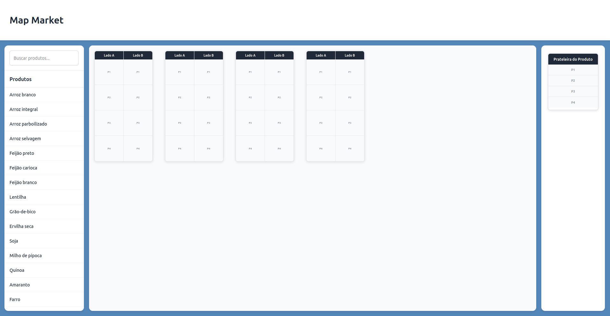

# 🛒MapMarket

O MapMarket é uma aplicação desenvolvida para facilitar compras em supermercados, permitindo que os usuários encontrem a
localização exata de produtos nas prateleiras. Ideal para melhorar a experiência do consumidor e otimizar o tempo de 
compra.

## 🗺️ Entenda o Mapa do Supermercado

O sistema utiliza um **mapa interativo** para representar as estantes físicas do supermercado, permitindo localizar produtos com precisão. Cada estante possui uma estrutura padronizada, conforme as imagens abaixo.

### 🧩 Estrutura da Estante

- **Estante:** é o bloco principal que agrupa os produtos. O supermercado pode ter várias estantes lado a lado.
- **Lado:** cada estante tem dois lados (A e B), representando as duas faces acessíveis da estrutura física.
- **Parte (P1, P2, ...):** são os blocos verticais que dividem cada lado da estante. Cada parte representa uma divisão visível da estrutura.
- **Shelf (ou Prateleira):** são as faixas horizontais dentro de cada parte — onde os produtos são realmente armazenados.

Essa divisão permite que cada produto seja localizado com precisão usando: **Estante + Lado + Parte + Shelf**.

### 📌 Visual do mapa (interface real)



### 🔍 Estrutura explicativa do mapa


---

## ✅ Requisitos
Antes de começar, certifique-se de ter os seguintes softwares instalados:
- 🧃 Java 17+
- 📦 Maven
- 🐳 Docker e Docker Compose
- 🐬 MySQL (caso deseje rodar sem Docker)

## 🚀 Execute a aplicação:

1. Clone o repositório:
    ```bash
    git clone git@github.com:Phyllipesa/map-market-v1.git
    ```

2. Navegue até o diretório do projeto:
    ```bash
    cd map-market-v1
    ```

<details>
<summary>🐳 Rodando com Docker Compose</summary>

1. Crie o arquivo `.env` na raiz do projeto com base no exemplo:
    ```bash
    cp .env.example .env
    ```
   O arquivo `.env.example` já possui configurações padrão funcionais para ambiente Docker.


2. Suba a aplicação com Docker Compose:
    ```bash
    docker compose up -d --build
    ```

3. Acesse a aplicação:
   - **Frontend**: [http://localhost:4200](http://localhost:4200)
   - **Backend (API)**: [http://localhost:8080](http://localhost:8080)


4. Utilize as configurações de ENV e Collections fornecidas na pasta "docs" com o Postman ou outra ferramenta similar para realizar requisições e testar a API.
</details>


<details>
<summary>💻 Rodando sem Docker Compose</summary>

- ### 🗃️ Banco de dados

1. Crie o banco de dados no seu servidor MySQL:
   ```bash
   CREATE DATABASE map_market_db;
   ```
   **Anote as informações de conexão** (host, porta, usuário e senha).


- ### ☕ Backend

1. Navegue até o diretório do backend:
    ```bash
    cd backend
    ```

2. Abra o backend utilizando a IDE de preferência


3. No arquivo `application-local.yml` em **src/main/resources**, atualize os seguintes campos com as credenciais e o 
endereço do seu banco MySQL:
   ```yml
   spring:
      datasource:
         driver-class-name: com.mysql.cj.jdbc.Driver
         url: jdbc:mysql://localhost:3306/map_market_db
         username: seu_usuario
         password: sua_senha
   ```

4. Ative o perfil **local** no `application.yml`.
   ```yml
   spring:
      profiles:
      active: local
   ```

5. Execute a aplicação:
   ```bash
   mvn spring-boot:run
   ```
   A aplicação será iniciada em [http://localhost:8080](http://localhost:8080).


6. Utilize o `environment` e a `collection` fornecida na pasta ".docs" com o Postman ou outra ferramenta similar para realizar requisições e testar a API.


- ### 🌐 Frontend

1. Navegue até o diretório do frontend:
   ```bash
   cd ../frontend
   ```
   
2. Execute a aplicação
   ```bash
   npm run start:local
   ```
   A aplicação será iniciada em [http://localhost:4200](http://localhost:4200).

</details>


## 🛠️ Tecnologias


## 👨‍💻 Autor
[](https://www.linkedin.com/in/phyllipe-albuquerque/)

[](https://github.com/phyllipesa)
